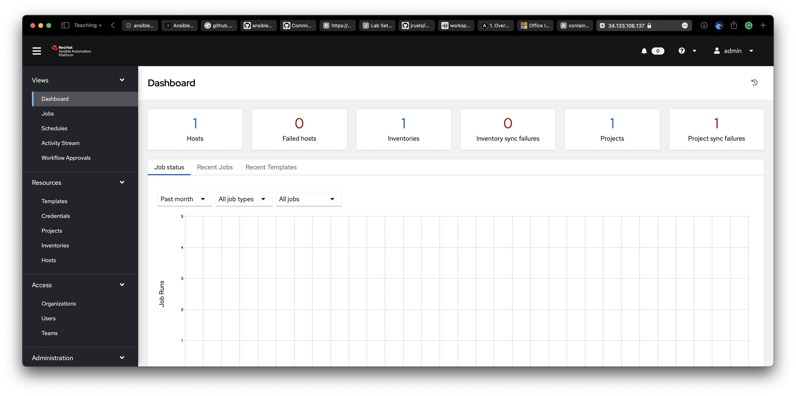

# Ansible Automation Platform

## Install Ansible Automation Platform

### Prerequisites

Ansible Automation Platform (AAP), requires your code be stored in version control. We are going to create a GitHub repository for our Ansible playbooks.


#### Create a new Repository in your personal GitHub Account.

Inside the Windows VM complete the following steps.

1. Log in or Create a new account [GitHub](https://github.com/) account
2. Click New Repository
3. Name the reposistory `ansible-working`
4. Check the `Add a README file` checkbox
5. Click the `Create Repository` button
6. In the new repository click the `code` button to expose the `https url` for the repository
7. Click the copy button to copy the `https url` for the repo to use in the next step.


#### Open the newly created repository in VS Code

1. Launch VS Code from the Start Menu or Task Bar
2. Select the Source Control Tab from the toolbar on the left
3. In the top of the VS Code window click "Untitled (Workspace)"
4. Type: `> clone` and choose `Git: Clone`
5. Paste the URL to newly created Repo
6. In the choose a folder dialog, select your `repos` folder.
7. Click the `select as Repository Destination` button
8. In the Visual Studio Code dialog click the `Add to Workspace` button to open the repository in VS Code
9. In the left Toolbar click the Explorer button.


#### Red Hat Developer account

Go to the [Red Hat Developer portal](https://developers.redhat.com/about), click "Join now," and fill out the form. 

Provide the following: 

* Username 
* Email address 
* Job role 
* Password 


#### Red Hat registry service account token

Navigate to the [Registry Service Account Management Application](https://access.redhat.com/terms-based-registry/), and log in if necessary.

1. From the **Registry Service Accounts** page, click the **New Service Account** button.

2. Provide a name for the Service Account. It will be prepended with a fixed, random string.

   - Enter a description.
   - Click **create**.

3. Navigate back to your Service Accounts.

4. Click the Service Account you created.

   - Note the username, including the prepended string (i.e. `XXXXXXX|username`). This is the username that should be used to log in to registry.redhat.io in the `inventory` file.
   - Note the password. This is the password that should be used to authenticate to [registry.redhat.io.](https://registry.redhat.io) in the `inventory` file.


**RUN ON THE CONTROL NODE**


### Install Automation Platform 


Install `subscription-manager`

```bash
sudo yum install -y subscription-manager
```


Register VM with Red Hat package repos

```bash
sudo subscription-manager register --auto-attach
```


When prompted, provide your Red Hat Developer username and password.

The installation file has already been copied to the `/home/ansible` directory. 


Enter directory 

```bash
cd /home/ansible/ansible-automation-platform-setup-bundle-2.4-7.5-x86_64
```


The latest version of AAP does not support installation on `localhost`. Due to this, we need to add the following to `/etc/hosts`


We can't use VS Code for this because we must edit the file with elevated privileges in the terminal.

Using `sudo` open `/etc/hosts` in your favorite editor. 

```
sudo vi /etc/hosts
```


Now add `aap.localhost.com` to the end of the line beginning with `127.0.0.1` so it looks like this:

```
127.0.0.1   localhost localhost.localdomain localhost4 localhost4.localdomain4 aap.localhost.com
```

Save the file and run the following to test.

```
ping aap.localhost.com
```

After confirming it resolves to `127.0.0.1`, type `ctrl+c` to stop the `ping`

Delete the original inventory file

```bash
rm -rf inventory
```


In the `ansible-automation-platform-setup-bundle-2.4-7.5-x86_64` folder, create a new `inventory` file and paste the following.

```
[automationcontroller]
aap.localhost.com ansible_connection=local

[database]

[all:vars]
admin_password='Password1234'
redis_mode = standalone

pg_host=''
pg_port=''

pg_database='awx'
pg_username='awx'
pg_password='Password1234'

registry_url='registry.redhat.io'
registry_username='<YOUR_REGISTRY_NAME>'
registry_password='<YOUR_REGISTRY_TOKEN'
```

Set the following in the `inventory` file (if not already completed) 

* admin password = Password1234   
* pg_password = Password1234   
* registry_username = The username generated earlier in the lab (i.e 15765574|ansible-tower)   
* registry_password = The token you generated earlier in the lab.   

Run installation script

```bash
sudo ./setup.sh -e required_ram=2048
```


**NOTE**: This will take some time to complete.


After the script above completes, you can access the Dashboard at the following URL (replacing `Server IP` with your Controller lab VM IP)  

https://[Server IP from spreadsheet]


Log into the dashboard with the username `admin` and the password you specified in the `inventory` file `Password1234`


> NOTE: You can reset the admin password by running the following on the Ansible Control VM:
>
> ```bash
> sudo awx-manage changepassword admin
> ```


You will see a screen asking to register Automation Platform. Log in with your Red Hat developer credentials.


Select your subscription, and click "Next"


Accept defaults, and click "Next"


Accept the license agreement and click "Submit"


You should now see the dashboard 



### Congratulations
